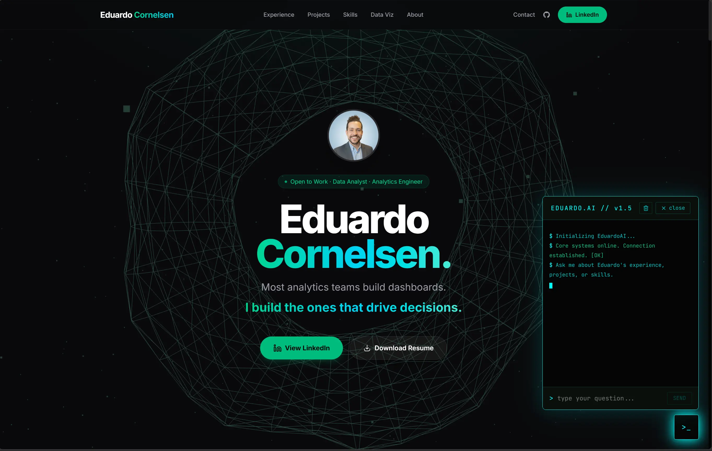

<div align="center">
  
</div>

# Eduardo Cornelsen — Portfolio + AI Chatbot

> Engineered a production-grade personal portfolio with a streaming AI chatbot, containerized via Docker, and deployed through a zero-touch CI/CD pipeline on Google Cloud Run — demonstrating full-stack ownership, LLMOps observability, and 4-layer prompt-injection security at $0/month infrastructure cost.

**Live site:** [eduardocornelsen.com](https://eduardocornelsen.com)

---

## Start Here — One Prompt to Set Up Everything

> **You do not need to be a programmer.** Open this project in **Claude Code** or **Google Antigravity IDE**, paste the prompt below, and the AI will walk you through every step interactively — reading your files, running commands, asking for your API keys when needed, and setting up your live site from scratch.

### How to open the project in your AI IDE

**Claude Code (terminal):**
```bash
# Install Claude Code if you haven't already
npm install -g @anthropic-ai/claude-code

# Open this project
cd cv-educornelsen
claude
```

**Google Antigravity IDE:**
Open Antigravity → File → Open Folder → select the `cv-educornelsen` folder.

---

### The prompt — copy and paste this exactly

```
Read the README.md file in this project carefully. Then act as my personal setup guide and execute the full setup from start to finish, step by step.

Here is what I need you to do:

1. Read README.md and build a clear step-by-step plan before doing anything.
2. Walk me through each step interactively:
   - Before running any command, explain what it does in plain English.
   - When you need a secret or API key from me (Gemini, LangFuse, Google Analytics, GCP), pause and ask me for it clearly — tell me exactly where to get it and what to paste.
   - Run the command or make the change, then confirm it worked before moving on.
3. Set up the full environment:
   - Clone/install dependencies
   - Create the .env file from .env.example and fill it with my values
   - Configure Google Analytics (ask me for my Measurement ID)
   - Configure Gemini API key (ask me for it)
   - Configure LangFuse (ask me for the keys)
   - Run the site locally to confirm it works
4. Set up Google Cloud Platform:
   - Help me create a GCP project
   - Enable Cloud Run and Artifact Registry APIs
   - Create the Artifact Registry repository
   - Create a service account and download the JSON key
5. Set up GitHub CI/CD:
   - Help me create a GitHub repository (if I don't have one yet)
   - Add all required GitHub Secrets (GCP_PROJECT_ID, GCP_SA_KEY, GEMINI_API_KEY)
   - Update the deploy.yml workflow file with my project details
   - Push the code and watch the first deployment succeed
6. Verify the live deployment:
   - Confirm the site is accessible on the Cloud Run URL
   - Test the chatbot is responding
   - Show me where to find my LangFuse traces

If anything fails, diagnose the error and fix it before moving on. Never skip a step. Ask me one thing at a time — do not overwhelm me with multiple questions at once.

Start now by reading README.md and telling me the plan.
```

---

## What This Is

A personal portfolio website built from scratch with React + TypeScript. It includes an AI chatbot (powered by Google Gemini) that answers questions about Eduardo's experience, projects, and background. The site is fully containerized with Docker and deploys automatically to Google Cloud Run whenever you push to the `main` branch.

This repository is structured so a **non-programmer using Claude Code or Antigravity IDE** can follow along and replicate the entire setup — from a blank laptop to a live website with a working AI chatbot.

---

## Architecture Overview

```
Browser
  │
  ├── React 19 + Vite (Frontend)
  │     ├── Portfolio sections (experience, projects, skills, viz, about)
  │     ├── 3D torus visualization (Three.js)
  │     └── Chatbot UI (SSE streaming)
  │
  └── Express.js (Backend proxy — keeps API keys server-side)
        ├── POST /api/chat → Google Gemini API (streaming)
        ├── Rate limiting + IP throttling
        ├── Canary token injection (prompt-leak detection)
        └── LangFuse tracing (cost, latency, safety per conversation)

Deployment:
  GitHub push → GitHub Actions
    → Docker build (multi-stage: Vite build + Express runtime)
    → Push to Google Artifact Registry
    → Deploy to Google Cloud Run (us-central1)
```

---

## Prerequisites

Before starting, you need accounts on these platforms. All have free tiers sufficient for a personal portfolio.

| Service | Purpose | Free? |
|---|---|---|
| [GitHub](https://github.com) | Code hosting + CI/CD | Yes |
| [Google Cloud Platform (GCP)](https://cloud.google.com) | Cloud Run + Artifact Registry | $300 free credit |
| [Google AI Studio](https://aistudio.google.com) | Gemini API key (chatbot) | Yes |
| [LangFuse](https://langfuse.com) | Chatbot observability | Yes |
| [Google Analytics](https://analytics.google.com) | Website traffic analytics | Yes |
| [Node.js 20+](https://nodejs.org) | Local development runtime | Yes |
| [Docker Desktop](https://www.docker.com/products/docker-desktop/) | Container building | Yes |

You also need an IDE. This guide assumes you're using **Claude Code** (terminal) or **Antigravity IDE** (visual, recommended for non-programmers).

---

## Step 0 — Understanding the Project Structure

Before touching anything, spend 5 minutes reading this map:

```
portfolio-eduardo/
│
├── src/                        ← All frontend React code
│   ├── components/             ← UI pieces (portfolio, chatbot, torus, etc.)
│   ├── hooks/useChat.ts        ← Chatbot state: messages, streaming, rate limit
│   ├── utils/analytics.ts      ← Google Analytics event tracking
│   ├── utils/chatbot.ts        ← Chatbot system prompt (what the AI "knows")
│   └── content/projects/       ← Markdown files for each project card
│
├── server/                     ← Express backend (runs in production + Docker)
│   ├── index.js                ← Server entry point, /api/chat route
│   ├── chatHandler.js          ← Calls Gemini API, streams response, tracks cost
│   ├── instrumentation.js      ← LangFuse + OpenTelemetry setup
│   └── security.js             ← Rate limiting, canary tokens, jailbreak detection
│
├── .github/workflows/
│   └── deploy.yml              ← CI/CD: build Docker image → push → deploy
│
├── Dockerfile                  ← Multi-stage container definition
├── .env.example                ← Template for your environment variables
├── .env                        ← Your actual secrets (NEVER commit this file)
├── vite.config.ts              ← Vite build config (includes dev chat plugin)
└── package.json                ← All scripts and dependencies
```

> **Tip for non-programmers:** Think of `src/` as the "what users see", `server/` as the "hidden engine", `.github/` as the "auto-deploy robot", and `.env` as your "password notebook" that never leaves your machine.

---

## Step 1 — Clone the Repository

Open your terminal (or the terminal inside Antigravity/Claude Code) and run:

```bash
git clone https://github.com/eduardocornelsen/cv-educornelsen.git
cd cv-educornelsen
```

This downloads a copy of the project to your machine.

---

## Step 2 — Install Dependencies

```bash
npm install
```

This reads `package.json` and downloads all the libraries the project needs into a folder called `node_modules`. It may take 1–2 minutes the first time.

---

## Step 3 — Set Up Environment Variables

Environment variables are secret values your app reads at runtime. They are **never** stored in the code itself.

1. Copy the example file:
   ```bash
   cp .env.example .env
   ```

2. Open `.env` in your editor. It looks like this:
   ```
   GEMINI_API_KEY=your-gemini-api-key-here
   LANGFUSE_SECRET_KEY=sk-lf-...
   LANGFUSE_PUBLIC_KEY=pk-lf-...
   LANGFUSE_BASE_URL=https://us.cloud.langfuse.com
   VITE_APP_URL=http://localhost:5173
   PORT=8080
   ```

3. Fill in each value following the sections below. Do not add quotes around values unless explicitly shown.

> **Important:** The `.gitignore` file already lists `.env` — this means git will never accidentally upload your secrets to GitHub.

---

## Step 4 — Get Your Gemini API Key (AI Chatbot)

The chatbot uses Google's Gemini AI model. You need a free API key.

1. Go to [aistudio.google.com/app/apikey](https://aistudio.google.com/app/apikey)
2. Sign in with your Google account
3. Click **"Create API Key"** → choose **"Create API key in new project"**
4. Copy the key (it starts with `AIza...`)
5. Paste it into `.env`:
   ```
   GEMINI_API_KEY=AIzaSy...your-actual-key
   ```

> **What this does:** The backend Express server sends your chatbot messages to Google's Gemini model and streams the reply back. The API key is what authenticates your requests. It never appears in the browser.

**Customizing the chatbot persona:**
The chatbot's "knowledge" — what it says about you — is in `src/utils/chatbot.ts`. Open that file and edit the system prompt to describe your own experience, projects, and personality.

---

## Step 5 — Set Up LangFuse (Chatbot Observability)

LangFuse lets you see every chatbot conversation, how much it cost, and whether anyone tried to jailbreak it. Optional but highly recommended.

1. Go to [langfuse.com](https://langfuse.com) → **Sign Up** (free)
2. Create a new **Project** (name it anything, e.g. "my-portfolio")
3. Go to **Settings → API Keys**
4. Copy **Secret Key** (starts with `sk-lf-`) and **Public Key** (starts with `pk-lf-`)
5. Update `.env`:
   ```
   LANGFUSE_SECRET_KEY=sk-lf-xxxxxxxx-xxxx-xxxx-xxxx-xxxxxxxxxxxx
   LANGFUSE_PUBLIC_KEY=pk-lf-xxxxxxxx-xxxx-xxxx-xxxx-xxxxxxxxxxxx
   LANGFUSE_BASE_URL=https://us.cloud.langfuse.com
   ```

> **What this does:** Every time someone sends a message to your chatbot, a "trace" is sent to LangFuse showing the full conversation, tokens used, estimated cost, and whether a jailbreak was detected. You can view this dashboard at [cloud.langfuse.com](https://cloud.langfuse.com).

If you skip this step, the chatbot still works — tracing just won't be active.

---

## Step 6 — Set Up Google Analytics

Google Analytics tracks who visits your site, which sections they scroll to, and how they interact with the chatbot.

1. Go to [analytics.google.com](https://analytics.google.com)
2. Click **"Start measuring"** → fill in your account and property name
3. Choose **Web** → enter your site URL (e.g. `https://yourdomain.com`)
4. Copy your **Measurement ID** (format: `G-XXXXXXXXXX`)
5. Open `src/main.tsx` and find:
   ```ts
   initGA('G-XXXXXXXXXX');
   ```
   Replace `G-XXXXXXXXXX` with your actual Measurement ID.

> **What this does:** The `initGA()` call initializes GA4 on page load. Custom events like scroll depth (25/50/75%) and chatbot interactions are already wired in `src/utils/analytics.ts` — they'll appear automatically in your GA4 dashboard under **Events**.

---

## Step 7 — Run the Site Locally

With your `.env` filled in, start the development server:

```bash
npm run dev
```

Open your browser at [http://localhost:5173](http://localhost:5173). You should see your portfolio.

The chatbot is fully functional in development mode — Vite includes a special plugin (`devChatPlugin` in `vite.config.ts`) that handles the `/api/chat` route without needing to run a separate Express server.

Other useful scripts:
```bash
npm run dev:server   # Run only the Express backend (port 8080)
npm run build        # Compile TypeScript + build production assets
npm run test         # Run unit tests
npm run test:contract # Run chatbot API contract tests
```

---

## Step 8 — Set Up Google Cloud Platform

GCP is where your website lives in production. You need three things: a project, the Cloud Run service, and the Artifact Registry (Docker image storage).

### 8.1 — Create a GCP Project

1. Go to [console.cloud.google.com](https://console.cloud.google.com)
2. Click the project dropdown (top-left) → **"New Project"**
3. Name it (e.g. `portfolio-eduardo`) → **Create**
4. Copy the **Project ID** (e.g. `portfolio-eduardo-123456`) — you'll need it later

### 8.2 — Enable Required APIs

In the GCP console, search for and enable these APIs:

- **Cloud Run API**
- **Artifact Registry API**
- **Cloud Build API** (optional, used if building on GCP)

Or run via Google Cloud Shell (the `>_` icon in the console):
```bash
gcloud services enable run.googleapis.com artifactregistry.googleapis.com
```

### 8.3 — Create an Artifact Registry Repository

This is where Docker images are stored before deployment.

1. In the console, go to **Artifact Registry** → **"Create Repository"**
2. Name: `portfolio-repo`
3. Format: **Docker**
4. Region: `us-central1`
5. Click **Create**

### 8.4 — Create a Service Account for GitHub Actions

GitHub Actions needs permission to push images and deploy to Cloud Run.

1. Go to **IAM & Admin → Service Accounts** → **"Create Service Account"**
2. Name: `github-deployer`
3. Grant these roles:
   - `Artifact Registry Writer`
   - `Cloud Run Admin`
   - `Service Account User`
4. Click **Done**
5. Click on the new service account → **Keys** → **Add Key** → **JSON**
6. Download the JSON file — this is your `GCP_SA_KEY` secret

### 8.5 — Set Cloud Run Environment Variables

Your API keys don't go in the Docker image — they're injected at runtime by Cloud Run.

1. Go to **Cloud Run** → find your service (after first deploy) → **Edit & Deploy New Revision**
2. Under **Variables & Secrets**, add:
   ```
   GEMINI_API_KEY      = your-gemini-key
   LANGFUSE_SECRET_KEY = sk-lf-...
   LANGFUSE_PUBLIC_KEY = pk-lf-...
   LANGFUSE_BASE_URL   = https://us.cloud.langfuse.com
   PORT                = 8080
   ```

> **Alternatively**, use GCP Secret Manager for more security. Store each secret there and reference it by name in the Cloud Run config.

---

## Step 9 — Set Up GitHub Actions (Auto-Deploy)

GitHub Actions is the "robot" that automatically builds and deploys your site every time you push code.

### 9.1 — Push Your Code to GitHub

1. Create a new repository on [github.com](https://github.com) (name it `cv-educornelsen` or anything you like)
2. Follow the instructions to push your local code:
   ```bash
   git remote add origin https://github.com/YOUR-USERNAME/YOUR-REPO.git
   git branch -M main
   git push -u origin main
   ```

### 9.2 — Add GitHub Secrets

GitHub Secrets store sensitive values that the Actions workflow can read.

Go to your repository → **Settings → Secrets and variables → Actions → New repository secret**

Add these secrets:

| Secret Name | Value |
|---|---|
| `GCP_PROJECT_ID` | Your GCP project ID (e.g. `portfolio-eduardo-123456`) |
| `GCP_SA_KEY` | The full contents of the JSON key file you downloaded in Step 8.4 |
| `GEMINI_API_KEY` | Your Gemini API key |

### 9.3 — Update the Workflow File

Open `.github/workflows/deploy.yml` and update these lines to match your setup:

```yaml
env:
  PROJECT_ID: ${{ secrets.GCP_PROJECT_ID }}   # ← already uses your secret
  REGION: us-central1                          # ← change if you used a different region
  SERVICE_NAME: portfolio-eduardo              # ← change to your preferred service name
  REPOSITORY: portfolio-repo                  # ← must match what you created in step 8.3
```

Also update the `VITE_APP_URL` in the build step to your domain:
```yaml
--build-arg VITE_APP_URL="https://your-domain.com" \
```

### 9.4 — Trigger Your First Deploy

Push any change to `main`:
```bash
git add .
git commit -m "chore: trigger first deploy"
git push
```

Go to your GitHub repository → **Actions** tab. You'll see the workflow running. After ~3 minutes, your site will be live on Cloud Run.

> **Finding your Cloud Run URL:** Go to GCP console → **Cloud Run** → click your service → the URL is at the top (e.g. `https://portfolio-eduardo-xxxxx-uc.a.run.app`). You can map a custom domain under **Manage Custom Domains**.

---

## Step 10 — Connect a Custom Domain (Optional)

If you have a domain (e.g. from Google Domains, Namecheap, Cloudflare):

1. In Cloud Run, go to your service → **Manage Custom Domains** → **Add Mapping**
2. Enter your domain, click **Continue**
3. GCP gives you DNS records to add (usually `A` and `CNAME` records)
4. Add those records at your domain registrar
5. SSL is provisioned automatically (free, managed by Google)

---

## How the Chatbot Works

Here's a simplified trace of what happens when a user sends a message:

```
User types a message in the browser
          ↓
useChat.ts: validates input (max 500 chars, rate limit 10/min)
          ↓
POST /api/chat  { message, history, sessionId }
          ↓
server/index.js: IP rate limit check (20 msg/min)
          ↓
server/chatHandler.js:
  1. Builds system prompt with injected canary UUID
  2. Intent classification (jailbreak regex check)
  3. Calls Gemini API with streaming enabled
  4. Streams response tokens back as SSE events
  5. Checks response for canary leak / prompt fingerprints
  6. Sends trace to LangFuse (cost, latency, safety flag)
          ↓
Browser: SSE listener parses events, appends tokens to chat UI
          ↓
sessionStorage: conversation history persisted for the session
```

**SSE (Server-Sent Events)** is what makes the chatbot stream word-by-word instead of waiting for the full response. The browser opens a long-lived HTTP connection and the server pushes each token as it arrives from Gemini.

---

## Customizing the Chatbot for Your Portfolio

All the chatbot's "knowledge" about you is in one file: `src/utils/chatbot.ts`

Find the `SYSTEM_PROMPT` constant and rewrite it to describe yourself:

```typescript
const SYSTEM_PROMPT = `
You are [YOUR NAME]'s AI assistant. Answer questions about [YOUR NAME]'s 
background, projects, and experience.

About [YOUR NAME]:
- Current role: ...
- Key skills: ...
- Notable projects: ...
- Education: ...

Rules:
- Stay in character. Only discuss [YOUR NAME]'s background.
- If asked something unrelated, politely redirect.
- Be concise and professional.
`;
```

---

## Frequently Asked Questions

**Q: Do I need to know how to code?**
A: Not to run the site. With Claude Code or Antigravity, you can describe what you want to change in plain English and the AI will write the code. Reading this README is enough to understand the structure.

**Q: How much does this cost to run?**
A: Effectively $0/month for a personal portfolio. Cloud Run charges only when your site is receiving traffic, and the free tier covers millions of requests. Gemini API has a free tier. LangFuse has a free tier.

**Q: My deploy failed. What do I do?**
A: Go to GitHub → Actions → click the failed run → expand the failed step. The error message will tell you exactly what went wrong. Common issues: wrong GCP project ID, missing secret, API not enabled.

**Q: Can I use a different AI model instead of Gemini?**
A: Yes. Open `server/chatHandler.js` and look for the model name. The Google GenAI SDK supports all Gemini variants. To use a completely different provider (OpenAI, Anthropic), you'd replace the SDK import and API call — Claude Code can do this for you if you describe what you want.

**Q: How do I update the content (experience, projects)?**
A: The portfolio sections are in `src/components/PortfolioEduardo.tsx`. Each project card has a `title`, `desc`, `tags`, and `readme` (pointing to a `.md` file in `src/content/projects/`). Edit those files to reflect your own work.

**Q: Is this safe to make public?**
A: Yes, as long as `.env` is never committed. Double-check with `git status` — `.env` should never appear as a file to be committed. The `.gitignore` file prevents this, but always verify.

---

## Stack Reference

| Layer | Technology |
|---|---|
| Frontend framework | React 19 + TypeScript |
| Build tool | Vite 6 (SWC compiler) |
| Styling | TailwindCSS 4 |
| 3D visualization | Three.js + React Three Fiber |
| Animation | Motion (Framer Motion successor) |
| Backend | Express.js (Node.js 20) |
| AI model | Google Gemini 2.5 Flash |
| Streaming | Server-Sent Events (SSE) |
| Observability | LangFuse v5 + OpenTelemetry |
| Analytics | Google Analytics 4 (react-ga4) |
| Containerization | Docker (multi-stage, Alpine) |
| Container registry | Google Artifact Registry |
| Hosting | Google Cloud Run |
| CI/CD | GitHub Actions |
| IDE (recommended) | Claude Code / Antigravity |

---

## License

MIT — use freely, attribution appreciated.
